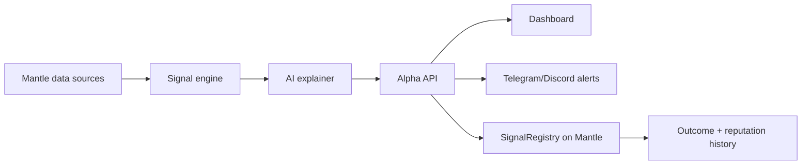

# Architecture

## System Overview



## Components

### Data Adapters

Initial adapters can use mock fixtures with the same shape as live adapters. Live sources can later include Mantle RPC, Mantlescan/Etherscan-style APIs, DEX subgraphs, protocol APIs, or curated smart-wallet lists.

Current adapter boundary:

- `FixtureSnapshotAdapter`: deterministic hackathon demo snapshot.
- `LiveMantleAdapter`: configured by `MAS_DATA_MODE=live`, `MANTLE_RPC_URL`, and `MANTLE_INDEXER_URL`.
- `/api/data/source-status`: exposes whether the current scan is fixture-backed or live-ready.
- `/api/data/live-probe`: reads real Mantle RPC `eth_chainId` and `eth_blockNumber`.

The detector input shape stays stable:

```text
smartMoneyCohorts[]
protocolFlows[]
yieldAssets[]
thresholds{}
```

### Signal Engine

The signal engine should be deterministic. It computes anomaly scores and selects candidate signals before any LLM explanation.

Primary detectors:

- `smart_money_rotation`: multiple tracked wallets accumulate the same asset or interact with the same pool within a time window.
- `protocol_flow_spike`: swap volume, LP activity, or transaction count rises above baseline.
- `yield_asset_accumulation`: smart wallets increase exposure to mETH, cmETH, USDY, or similar Mantle yield assets.

Current MVP implementation:

```text
apps/api/fixtures/mantle_demo_snapshot.json
  -> sentinel.detectors.detect_signals
  -> sentinel.explainer.explain_signal
  -> sentinel.hashing.stable_hash
  -> /api/alpha/scan
```

Outcome benchmarking:

```text
signal prediction
  -> apps/api/fixtures/outcome_snapshot.json
  -> sentinel.outcomes.resolve_signal_outcome
  -> /api/alpha/track-record
```

### AI Explainer

The AI layer explains structured evidence. It should not invent unsupported data, generate trades, or override confidence thresholds. For MVP, the API includes a deterministic explainer so the product can run without model keys.

### On-Chain Benchmarking

`SignalRegistry.sol` stores:

- signal hash
- agent id
- signal type
- target
- prediction horizon
- timestamp
- optional outcome status

The on-chain record proves the agent committed to a signal before the outcome was known.

## Data Contract

See `packages/schemas/signal.schema.json`.
